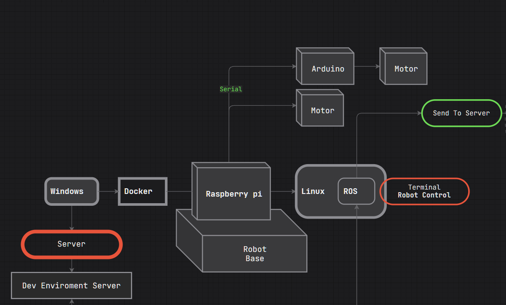
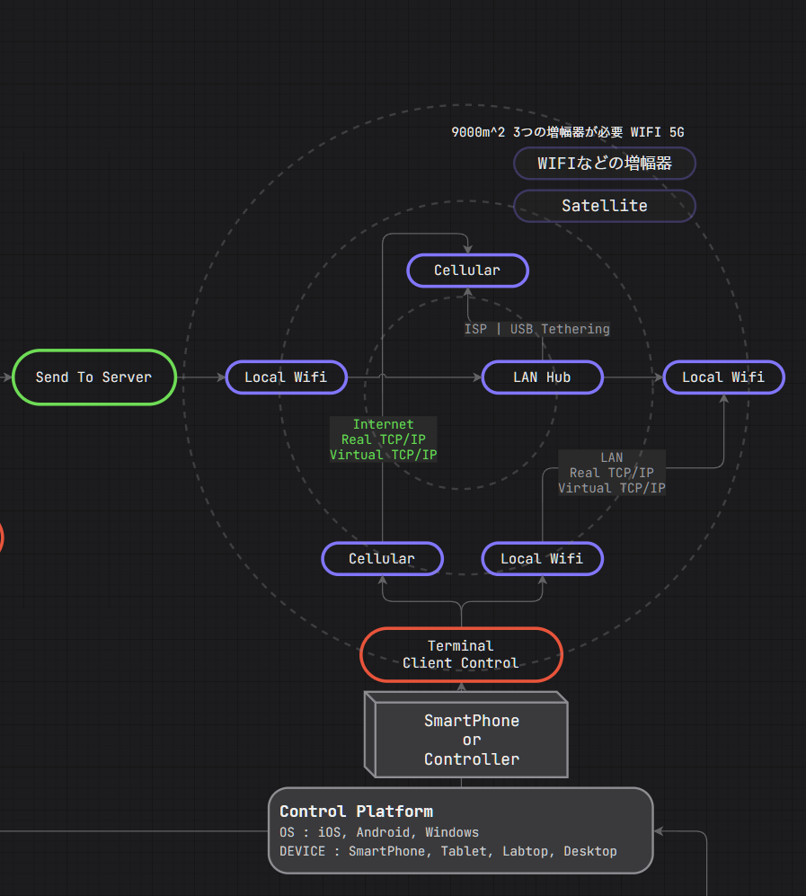
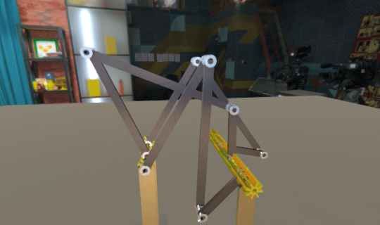
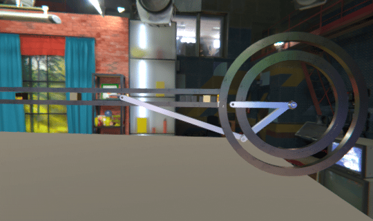

# XIR

## Robotics研究について
こちらにはコンピュータ科学のAIと共にロボットに関する紹介します。

色々な産業現場や様々な状況にとって、

そして、

国民の安全と国防を強くにするにも活用できます。

### Diagram
事前に3D環境でロボットを物理的にシミュレーションして、

改善したり、テストしたり活用する方法です。

IoT概念としてもあるので、

交換性やMODULE型を考えて全ての分野にも共通的に活用できるようにします。

MOTOR部分の代わりにセンサ(SENSOR)もいれます。

例えば、

ライダー(LiDAR)とカメラで収集した情報をServerに転送してOpenCVなどのComputerVisionで

認識させます。GPSなどで方向を設定して移動のルートを決定します。

移動しながら3DNavBakingやA*Pathfindingで障害物を避けて進みます。

Serverは離れている所にも設置して置く事が出来ます。

または、ロボットにも仕様がよいコンピュータを設置するのも可能です。

#### Robot Side

#### Client Side

シミュレーションの結果でまたはシミュレーションで動くことも可能です。

現場の位置とシミュレーション環境の位置(Rotation, Coordination, Etc)を同期化したら、

一度、事前にシミュレーションして問題を解決して行う事も可能です。

PhysicsとJoint情報として活用する方法なので、モーターの詳細調整もできると思います。

### GRID SYSTEM & AUTO PAIRING
無人ドロンや飛行機などで

いくつかの機器は

端末(TERMINAL)として、サーバー(SERVER)として役割を果たします。

増幅器を付けたら、通信の可能範囲を広げることも可能です。

### REMOTE PAIRING & MODULE UPDATE & CHARGE SYSTEM
バッテリーが切れる前に他のバッテリーを持つ無人飛行機で

バッテリーを提供する事も可能だと思います。

他のMODULEで交換するのも。。。

