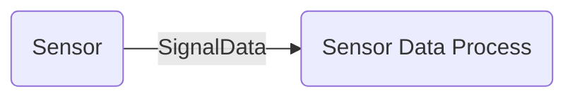

# Sensors
* Electro Magnetic Waves Sensor
* Vision Sensor
* Sound Sensor
* Measurement Sensor

### Camera Sensor
### NightVision Sensor
### Thermal Sensor
### LiDAR Sensor
2D, 3D, 3D+
### Light Sensor
### UltraSonic Sensor
### Temperature Sensor
### Metal Detector Sensor
### Humidity Sensor
### Acceleration Sensor
### Magnetic Sensor

# Sensor Processing
[Computer Vision](ComputerVision.md)

[LiDar Processing](LiDarProcessing.md)

[3D Reconstruction](3DReconstruction.md)

# Anti Sensors
### WIPS(Wireless Intrusion Prevention System)
