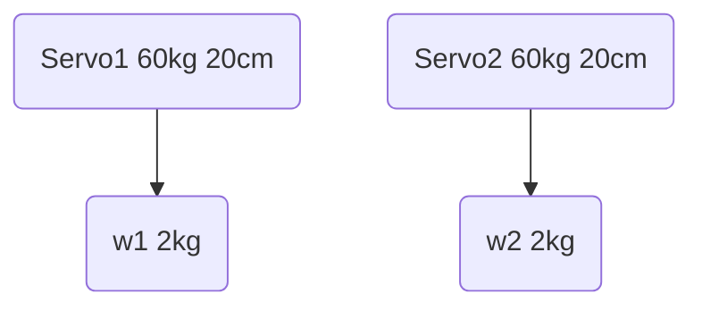

# Servo Motor

# Motor Capacity
## Specification
* Speed
* Gear Struction
* Control
## Motors
### AC
### DC
#### Brushless Motor and Torque
#### Drill Motor and Torque
#### 60Kg Servo and Torque
* 60Kg Servo, 2kg20cm, 40kg/cm, 6v
* 150Kg Servo, 5kg20cm, 100kg/cm, 13v, 30$~

# Battery Capacity
### Voltage
* 60v
* 24v
* 12v
* 
### Batteries
* 3.7v, 18650, 2200mAh, Lithium-Ion, full-charge/3-5 hours, last about 2~5 hours

### Charger
## Charge Speed per Supply Am
* 1.5A, 3A, XA more

* [Robot arm calculator](https://www.societyofrobots.com/robot_arm_calculator.shtml)
* [Robot torque tutorial](https://community.robotshop.com/tutorials/show/robot-arm-torque-tutorial)
