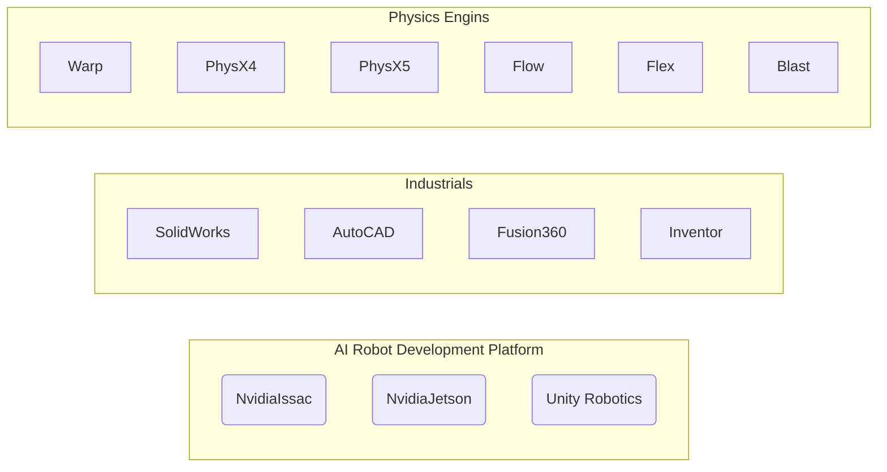

# Simulation
* ロボットを事前にテストしたり、改善したりすることができます。
* OpenSourceとして公開されて提供している物もあります。
* 直接、作る事も可能です。(数学と科学の知識が必要です。)

## Real-time physics engines
### Open source
* Advanced Simulation Library - open source hardware accelerated multiphysics simulation software
* Box2D
* Bullet
* Chipmunk physics engine - 2D physics engine
* Jolt Physics - Horizon Forbidden West physics engine
* Newton Game Dynamics
* Open Dynamics Engine
* PAL (Physics Abstraction Layer) - A uniform API that supports multiple physics engines
* PhysX
* Project Chrono - An open source simulation engine for multi-physics applications.
* Siconos Modeling and the simulation of mechanical systems with contact, impact and Coulomb's friction
* SOFA (Simulation Open Framework Architecture)
* Tokamak physics engine

### Closed source/limited free distribution
* Digital Molecular Matter
* Havok
* Chaos by Epic Games
* Vortex by CMLabs Simulations
* AGX Multiphysics by Algoryx Simulation AB
* Algodoo by Algoryx Simulation AB
* Rubikon by Valve Corporation
* High precision physics engines
* VisSim - Visual Simulation engine for linear and nonlinear dynamics

## Flexibilities and Expandable Engine
* Component
* Server, Client Programming
* AI, Control Programming
* Cross Devices
* Compatibilities
* Variations
* Realtime Programmable and Controllable System
* User Interface
* Publishing

## IDE

#### Robot Development Reference

* [Hackster](https://www.hackster.io/jlamperez10)
* [HowToMechatronics](https://howtomechatronics.com)
* [NvidiaJetson](https://developer.nvidia.com/embedded/community/jetson-projects/weed_killing_robot)
* [Unity-Robotics-Hub](https://github.com/Unity-Technologies/Unity-Robotics-Hub)

* [Microsoft Air Sim](https://microsoft.github.io/AirSim/)
* [GOOGLE ROBEL](https://sites.google.com/view/roboticsbenchmarks/platforms)
* [Warp](https://github.com/NVIDIA/warp)
* [Web Bot](https://cyberbotics.com/)
* [Wandelbots](https://www.wandelbots.com/)
* [ROSbot 2.0](https://robots.ros.org/)
* [Poppy Project](https://www.poppy-project.org/en/)
* [Linorobot](https://linorobot.org/)