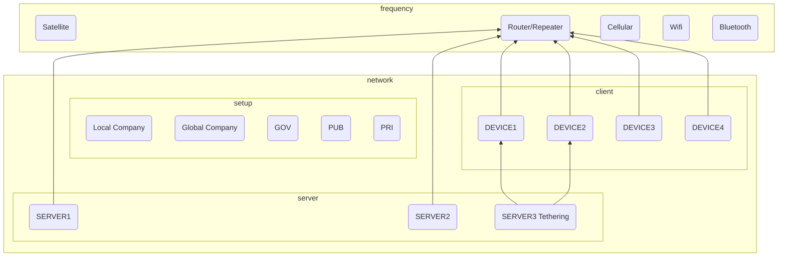
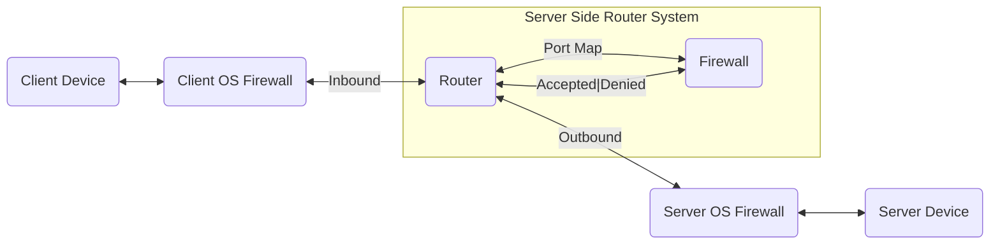

ロボットと通信する方法

## Network Device

### Bandwidth, range and power consumption

### Wifi

### Cellular

### LPWAN

• LTE-M

### Zigbee

65,000 devices in its mesh
Low data transfer (around 250 kbps)
Z-Wave

### Bluetooth

### Addition

#### Router

#### Repeater

#### Rechargeable

## Security

### Device Side Encrypted

### Firmware Side Encrypted

WPA2/

### Network Layer Side Encrypted

### Software Side Encrypted

* MD5, RSA256bitなどで、制御信号とメッセージを暗号化します。
* 画像と動画のデータは別のアルゴリズムで暗号化します。

### Human Side Encrypted

* 実際の活動に対応する仮想の場面で制御します。
* 右を左で変更します。

## Network Programming


### Socket Programming

* 一般的にデバイスと他のデバイスはIPとPortで繋ぎます。
* 相手に連結を要請するProgramはServer/Hostと言います。
* 相手に連結を受身するProgramはTerminal/Clientと言います。
* まずは参加する全てのデバイスを住所を入力してRouterに接続します。

Windows
```shell
ipconfig
#IP Address
#Subnet Mask
#Gateway
#Domain Name Server1
#Domain Name Server2
```
Mac/Linux/Unix
```shell
ifconfig         

ifconfig         #起動中のNICを表示
ifconfig -a      #DOWN中のNICも表示
ifconfig eth0    #NIC指定表示
```
OS Compatibilities
```shell
#Other Devicesと Link and Firewall テストをします
telnet 192.168.0.8 3389

ping 192.168.11.1  #ゲートウェイにパケットが届くことを確認
ping 8.8.8.8       #外部ネットワークのDNSサーバにパケットが届くことを確認
ping google.com    #名前解決されることを確認

tracert　#どこまで連結されたのかを表すことができます。
```
* インターネットなどの汎用Port以外には遮断されていますので、
* OS Firewallと Router Firewallを設定して繋ぎます。

OS Ports Compatibilities
* Telnet 23
* FTP 21
* SFTP 
* SSH 22
* SSL 443
* HTTP 80
* Tomcat 8080
* [reserved_ports.md](..%2FXIR_GIT%2Freserved_ports.md)


### Serial Programming

### USB Programming

### LAN/WAN Programming

#### Wired LAN

#### Wired Cross Cable

#### Wireless LAN

#### Wireless WAN


